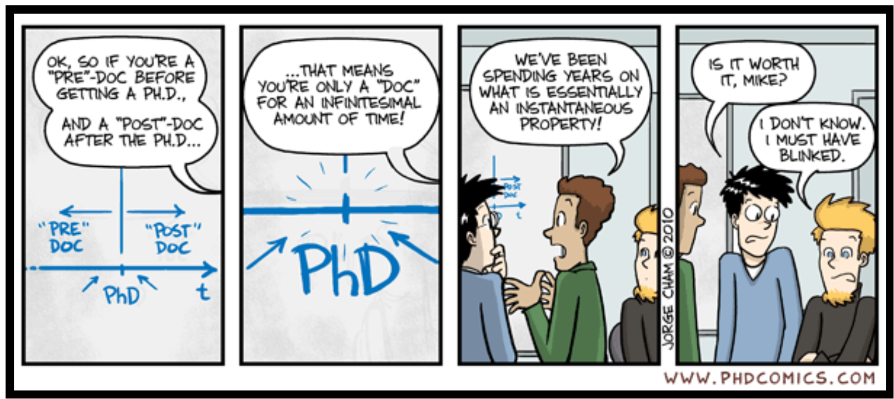
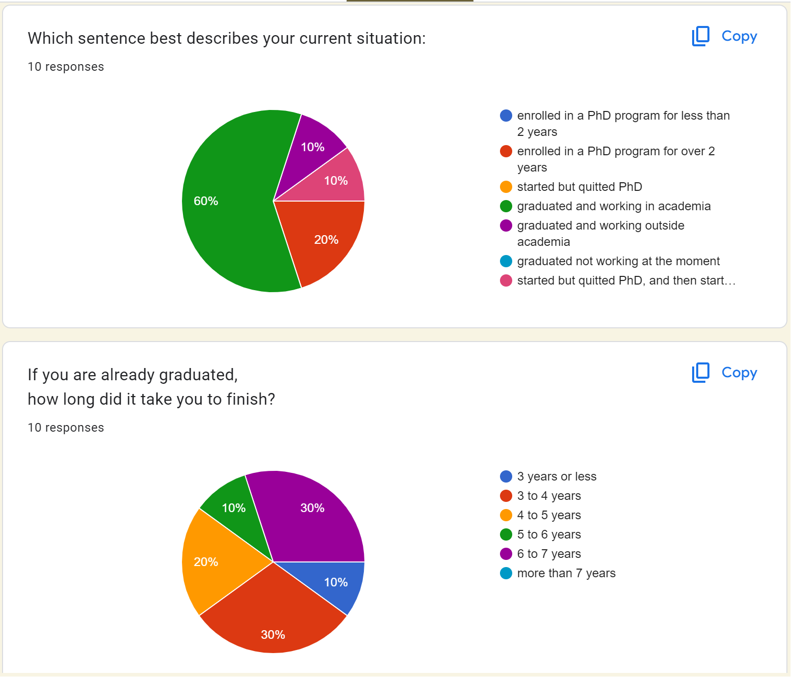
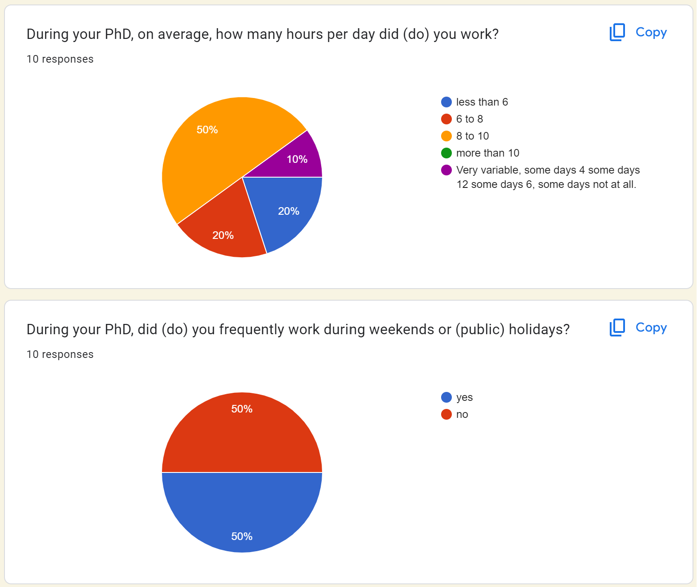
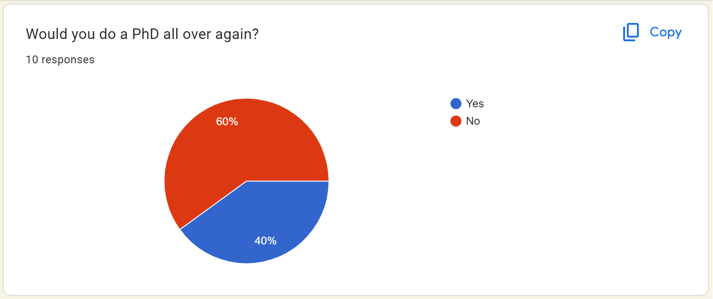
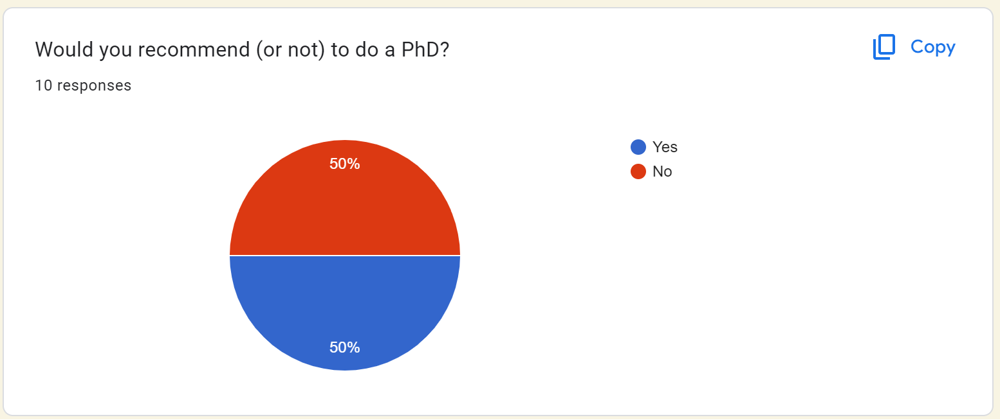

# PhD life survey

## hello visitor

Here I will publish and update the results from the _PhD life survey_. 

Did a PhD? Have not taken the survey yet? Yo can do it here: [PhD life survey](https://forms.gle/4NVZAtoYY6EhQbnC8)

Thank you for your attention, all best, 
Jazz (Yazmín Zurápiti)

-------------------------------------------------------------------------------------------------------------------

## updates on results

updated on 2024-02-04.

number of replies: 10 

countries of enrollment: Japan, Germany, United Kingdom (2), Sweden, Korea, United States of America, Sweden, France, Czech Republic.

### current situation of people

### how much work was/is being put into it

### opinion on doing it again and recommendation it to others

